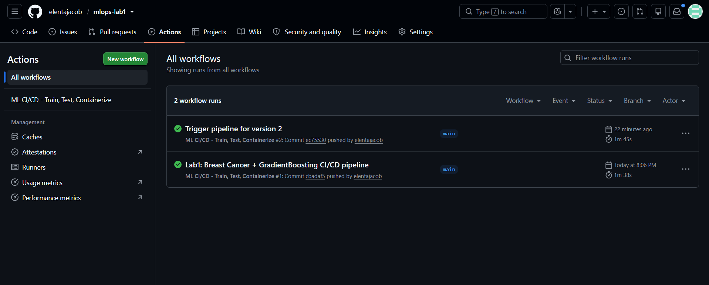
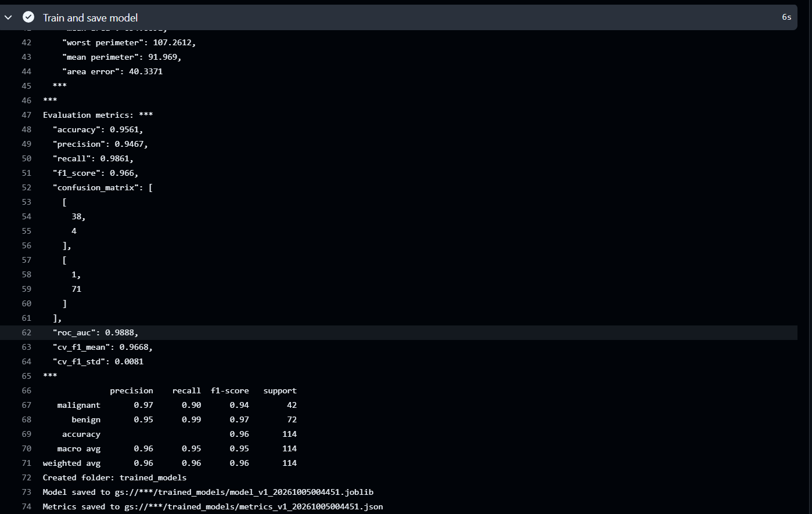
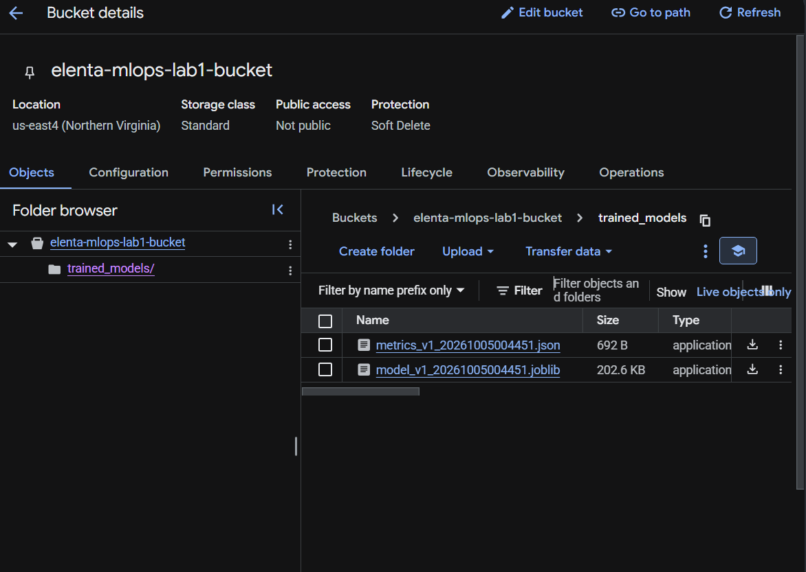
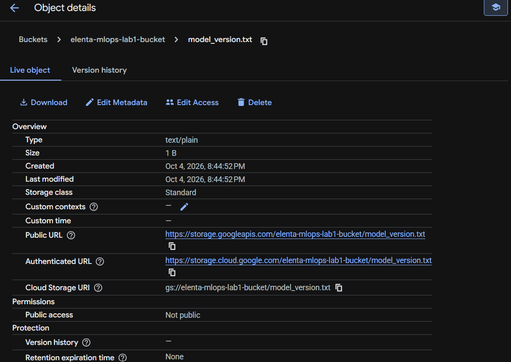
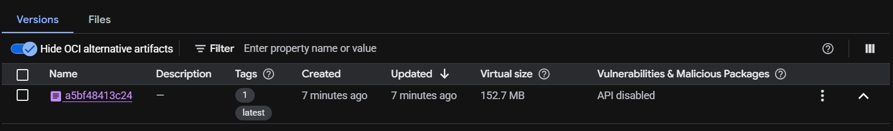
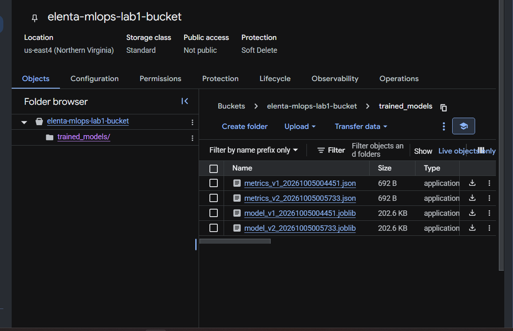
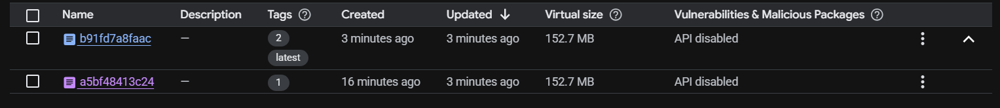

# MLOps Lab 1 — CI/CD for ML with GitHub Actions & GCP

**Author:** Elenta Jacob · M.S. Data Science, Northeastern University (Khoury College)

An end-to-end CI/CD pipeline for a machine learning model. Every push to `main` automatically **tests** the code, **trains** the model, **versions** it in Google Cloud Storage, and **containerizes** it into a Docker image pushed to Google Artifact Registry.

Based on the GitHub Actions + GCP Intermediate Lab (Lab 4) from the course repository, with my own modifications described below.

---

## My Modifications

| Component | Original Lab | My Version |
|---|---|---|
| **Dataset** | Iris (150 samples, 4 features, 3 classes) | **Breast Cancer Wisconsin** (569 samples, 30 features, binary: malignant vs. benign) |
| **Model** | Random Forest (100 trees) | **Gradient Boosting Classifier** (150 estimators, learning rate 0.1, max depth 3) |
| **Data split** | Random 80/20 split | **Stratified** 80/20 split (keeps class ratio equal in train and test) |
| **Evaluation** | Accuracy only | Accuracy, **precision, recall, F1, ROC-AUC, confusion matrix, 5-fold cross-validated F1**, full classification report |
| **Dataset statistics** | None | New `dataset_statistics()`: sample/feature counts, missing values, class distribution, class balance ratio, top feature means |
| **Artifacts saved to GCS** | Model only | Model **+ a versioned `metrics_vN.json`** file (dataset stats + all metrics) |
| **Unit tests** | 7 tests | **10 tests**, including new tests for statistics, evaluation, and metrics upload; fixed a mock-ordering bug in `test_get_model_version` |
| **CI/CD workflow** | Not included in the lab folder | Written from scratch: `.github/workflows/ci_cd.yml` |
| **Docker image** | Base image | Loads the trained model and runs a sample prediction on startup |

---

## Pipeline

```
git push → Run 10 unit tests → Authenticate to GCP → Train model
        → Save model + metrics to GCS (version N) → Build Docker image
        → Push to Artifact Registry (tags: N and latest)
```

Each run reads the current version from `model_version.txt` in the bucket, increments it, and tags everything with the new number.

---

## Results

| Metric | Score |
|---|---|
| Accuracy | **0.9561** |
| Precision | 0.9467 |
| Recall | 0.9861 |
| F1 score | 0.9660 |
| ROC-AUC | **0.9888** |
| 5-fold CV F1 | 0.9668 ± 0.0081 |

**Confusion matrix** (114 test samples):

| | Predicted Malignant | Predicted Benign |
|---|---|---|
| **Actual Malignant** | 38 | 4 |
| **Actual Benign** | 1 | 71 |

**Dataset statistics:** 569 samples, 30 features, 0 missing values. Classes: 212 malignant / 357 benign (balance ratio 0.59).

The low cross-validation standard deviation (0.008) shows performance is stable across folds rather than dependent on one lucky split.

---

## Repository Structure

```
mlops-lab1/
├── .github/workflows/ci_cd.yml    # GitHub Actions pipeline
├── src/train_and_save_model.py    # Data, statistics, training, evaluation, GCS versioning
├── test/test_pytest.py            # 10 unit tests (GCP calls mocked with MagicMock/patch)
├── screenshots/                   # Proof of successful runs
├── Dockerfile                     # Container with the trained model
├── requirements.txt
└── README.md
```

---

## GCP Setup

1. Create a GCP project and enable **Cloud Storage**, **Cloud Build**, and **Artifact Registry** APIs.
2. Create a service account with **Storage Admin**, **Storage Object Admin**, and **Artifact Registry Administrator** roles, and download a JSON key.
3. Create a GCS bucket and a Docker Artifact Registry repository named `my-repo` in `us-east4`.
4. Add these GitHub repository secrets (Settings → Secrets and variables → Actions):

| Secret | Value |
|---|---|
| `GCP_SA_KEY` | Full contents of the service account JSON key |
| `GCP_PROJECT_ID` | GCP project ID |
| `GCS_BUCKET_NAME` | Bucket name |
| `VERSION_FILE_NAME` | `model_version.txt` |

---

## Run Locally

```bash
python -m venv venv
venv\Scripts\activate            # Windows  (macOS/Linux: source venv/bin/activate)
pip install -r requirements.txt

python -m pytest test/ -v        # run the unit tests
```

To train and upload, create a `.env` file with `GCS_BUCKET_NAME` and `VERSION_FILE_NAME`, set `GOOGLE_APPLICATION_CREDENTIALS` to your key path, then run:

```bash
python src/train_and_save_model.py
```

---

## Screenshots

### 1. GitHub Actions — both pipeline runs passed


### 2. Dataset statistics and evaluation metrics (from the pipeline log)


### 3. GCS bucket after run 1 — model and metrics saved


### 4. Version file in GCS


### 5. Artifact Registry after run 1 — tags `1` and `latest`


### 6. GCS bucket after run 2 — version auto-incremented to v2


### 7. Artifact Registry after run 2 — `latest` moved to version `2`

